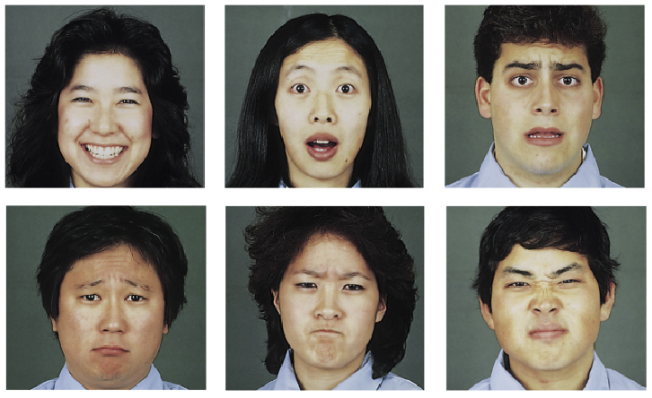

# UE Outils de représentation numérique : Initiation à Processing

## Studio Chevalvert

[Chevalvert](https://chevalvert.fr/about/) est un studio de design visuel basé à Paris.
Le studio conçoit des [identités](https://chevalvert.fr/identite/), des [typographies](https://chevalvert.fr/typographie/relief/) et des [installations interactives](https://chevalvert.fr/installation/).

Nous imaginons et réalisons des installations en utilisant du hardware et du software divers (stripLEDs, capteurs, Leap Motion, contrôleurs DMX, nodeJS, JavaScript ...) :
- [Stratum](https://chevalvert.fr/installation/stratum/) 
- [Le temps Suspendu](https://chevalvert.fr/installation/le-temps-suspendu/)
- [Mechane](https://chevalvert.fr/installation/mechane/)

Nous réalisons aussi des dispositifs en utilisant le software de programmation graphique [Processing](https://processing.org/) :  
- [Ink under paper](https://chevalvert.fr/installation/ink-under-paper/)  
Dans ce projet nous questionnons le lien entre la matière physique (le papier) et la matière numérique (l'encre digitale créée avec un algorithme qui simule un comportement liquide). 
- [Mechanical Frames](https://chevalvert.fr/installation/mechanical-frames/)
Une autre possibilité est de lier la génération graphique de Processing à des données physiques qui sont transmises au programme par la carte électronique ([Arduino](https://www.arduino.cc/)), reliée à son tous à des capteurs.  

## Qu'est-ce que Processing ?

Processing est est une bibliothèque Java et un environnement de développement libre. L'outil créé par [Ben Fry](https://fathom.info/about/) et [Casey Reas](http://reas.com/) est un le logiciel de programmation dédié à la création plastique et graphique interactive. 

- [Site web du logiciel + ressources](https://processing.org/)  
- [Plateforme d'échange de sketchs de la communauté](https://www.openprocessing.org/)

## Déroulé du workshop

3 séances de 4h
- S'initier à Processing en analysant les programmes fournis par nos soins
- Concevoir et réaliser un programme/expérience/objet (par groupes de 3)
- Documenter les programmes/expériences/objets réalisés
- Présentation du projet lors de la dernière séance

## Sujet de départ

En prolongation du sujet initié par Simon Renaud, nous vous proposons comme point de départ l'étude des 6 émotions de base définies par Paul Ekman. Vous réaliserez ensuite des programmes/expériences/objets en lien avec ce sujet.

Les 6 expressions faciales universelles définies par Ekman en 1972 sont :  
1- Tristesse  
2- Colère  
3- Peur  
4- Dégoût  
5- Surprise  
6- Joie  

Les caractéristiques de ces émotions de base :
- Elles sont biologiquement préprogrammées.
- Elles sont rapidement déclenchées et de courte durée.
- Elles possèdent des expressions faciales distinctes, spécifiques.
- Elles sont innées et donc présentes dès la naissance.
- Elles sont présentes chez d’autres primates que l’humain (ex. singe).
- Elles ont des expressions universelles. 

## Processus de documentation 

Tout au long du workshop vous devrez respecter une méthodologie de documentation de vos projets. Pour cela :
- Nous analyserons la méthodologie pour concevoir, réaliser et documenter des prototypes de dispositifs interactifs (étude de cas de projets réalisés au studio Chevalvert)
- Vous réaliserez la note d'intention de votre projet, les diagrammes d'interaction, les descriptifs de vos programmes, les croquis de mise en situation
- Vous documenterez tout le process de réalisation et le résultat en vidéo
- Nous créérons un dossier sur la page [Github](https://github.com) du workshop pour mettre en ligne vos projets et toute la documentation

## Pour commencer

[→ Importer, disposer et afficher une image](/cours-1/mood-generator-0)

## License

[MIT.](https://tldrlegal.com/license/mit-license)
