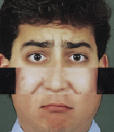
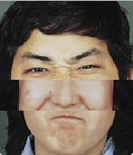
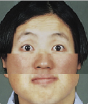

# cours-1/`mood-generator-2`

## Résumé

À chaque fois que l'utilisateur appuie sur la barre d'espace, le programme génère un visage aléatoire à partir de trois parties de visages : haut (`top`), milieu (`middle`) et bas (`bottom`).







## Description du programme

- Au lancement du programme, on charge aléatoirement l'une des 6 images de chacun des dossiers `top/`, `middle/` et `bottom/` en mémoire.
- On dessine les trois images chargées en mémoire l'une sur l'autre.
- Lorsque une touche est appuyée, si elle correspond à la barre d'espace, alors on recharge aléatoirement l'une des images de chacun des dossiers `top/`, `middle/` et `bottom/` en mémoire.

## Remarques

- la fonction `void keyPressed () { ... }` n'est exécutée que lorsque l'utilisateur appuie sur une touche.
- `if()` est une structures conditionnelle qui permet de déterminer si une condition est remplie, puis `else()`  permet d'exécuter une action en conséquence au résultat du test.    
On définit une structure conditionnelle simple `si... sinon...` comme suit : 
>```java
>if (condition à vérifier) {
>  // ce code entre accolades ne sera exécuté que si la condition est respectée, soit "true"
>} else {
>  // ce code sera exécuté si la condition à vérifier a un résultat "false"
>}
>```

## Pour aller plus loin

[→ Recharger seulement une partie du visage lorsque l'utilisateur clique dessus](../mood-generator-3)
