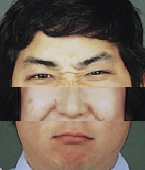
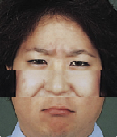
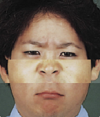
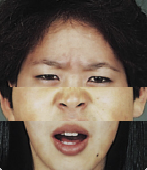

# cours-1/`mood-generator-3`

## Résumé

À chaque fois que l'utilisateur clique sur une partie d'une visage, le programme la change aléatoirement.





## Description du programme

- Au lancement du programme, on charge aléatoirement l'une des 6 images de chacun des dossiers `top/`, `middle/` et `bottom/` en mémoire.
- On dessine les trois images chargées en mémoire l'une sur l'autre.
- Lorsque la souris est cliquée :
  - **si** la position du curseur en `Y` (axe vertical) correspond à la partie haute, on recharge aléatoirement l'une des images du dossier `top/`.
  - **sinon si** la position du curseur en `Y` (axe vertical) correspond à la partie du milieu, on recharge aléatoirement l'une des images du dossier `middle/`.
  - **sinon** on recharge aléatoirement l'une des images du dossier `bottom/`.

## Remarques

- la fonction `void mousePressed () { ... }` n'est exécutée que lorsque l'utilisateur clique sur la souris.
- les variables `mouseX` et `mouseY` contiennent respectivement la position en `X` et en `Y` du curseur de la souris.
- on définit une structure conditionnelle complexe `si... sinon si... sinon si... sinon...` comme suit :
>```java
>if (condition 1 à vérifier) {
>  // ce code ne sera exécuté que si la condition 1 est respectée
>} else if (condition 2 à vérifier) {
>  // ce code sera exécuté si la condition 1 n'est pas respectée, mais que la condition 2 est respectée.
>} else {
>  // ce code ne sera exécuté que si aucune des conditions précédentes n'est respectée.
>}
>```

## Pour aller plus loin

[→ Générer un nouveau visage toutes les 3 secondes](../mood-generator-4)