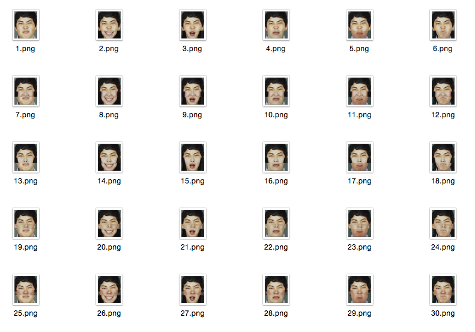

# cours-1/`mood-generator-6`

## Résumé

Tous les visages possibles sont générés et enregistrés, puis le programme quitte.


## Description du programme

- Au lancement du programme, on créé trois listes `tops`, `middles` et `bottoms` qui contiendront nos images chargées.
- Pour chaque liste, on itère chacun de ses items, et on leur assigne à chacun les images correspondantes.
- La fonction `generate()` ne charge plus les images en mémoire, mais change juste l'index de chaque liste d'images.

## Remarques

- un _array_ est une liste ou un tableau de plusieurs valeurs.
- on déclare un _array_ comme suit :
>```java
>type[] nomDeLaVariable = new type[longueurDeLArray];
>```
- il est possible de connaître la longueur d'un _array_ grâce à sa propriété `length` : `monArray.length`
- pour accéder à une entrée de l'array `monArray`, on utilise : `monArray[indexDeLEntrée]` :
>```java
>int[] myFavoriteNumbers = new int[3];
>myFavoriteNumbers[0] = 1337;
>myFavoriteNumbers[1] = 42;
>myFavoriteNumbers[2] = 101;
>
>for (int i = 0; i < myFavoriteNumbers.length; i++) {
>  println(myFavoriteNumbers[i]);
>}
>```
- **ATTENTION :** le premier item d'un array est à l'index `0`, et non `1` (`monArray[1]` correspond au deuxième item).  
Le dernier item d'un array de longueur `N` sera donc à l'index `N - 1`

## Pour aller plus loin dans la manipulation d'images sur Processing

[→ Manipuler des images](../../ressources/00_image)
