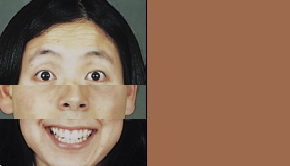

# Manipuler les images

## Importer et afficher une image

`PImage`, `loadImage()`, `image(monImage,x,y);` pour importer, charger en mémoire et afficher une image à l'intérieur de votre programme.

>```java
>PImage monImage;
>monImage = loadImage(mood-generator-1.png);
>image(monImage,0,0);
>```

## Manipuler une image

### `color()` 
Cette commande permet de stocker les composantes nécessaires à la création d'une couleur.
Chaque composante peut être extraite par les commandes `red()` `green()` `blue()` `alpha()` `hue()` `saturation()` `brightness()`

>```java
>color violet = color(180,0,255);
>background(violet);
>```

### `get()`
Cette commande permet d'obtenir la valeur couleur d'un pixel de l'écran.

[→ Exemple de programme obtenant la couleur d'un pixel de l'écran](sketch_1)
>```java
>PImage img;
>
>void setup() {
>  size(292, 168);
>  img = loadImage("data/mood-generator-1.png");
>  image(img, 0, 0);
>}
>
>void draw() {
>  // obtenir la valeur couleur d'un pixel de l'écran
>  color maCouleur = get(mouseX, mouseY);
>  // extraction de la composante rouge de la variable maCouleur
>  float r = red(maCouleur);
>  float g = green(maCouleur);
>  float b = blue(maCouleur);
>
>  fill(r, g, b);
>  rect(width/2, 0, width/2, height);
>}
>```




[→ Exemple de programme obtenant la couleur d'un pixel de l'image](sketch_1)
>```java
>PImage img;
>
>void setup(){
>  size(726, 444);
>  img = loadImage("data/ekman-emotions.png");
>  image(img,0,0);
>  for (int a = 0; a < width; a++){
>    color maCouleur = img.get(a,20);
>    stroke(maCouleur);
>    line(a,0,a,height/1.25);
>  }
>}
>```


[→ Exemple de programme obtenant la couleur d'un pixel de l'image et animation du pattern](sketch_2)
>```java
>PImage img;
>int y = 0;
>
>void setup() {
>  size(726, 444);
>  img = loadImage("data/ekman-emotions.png");
>  image(img, 0, 0);
>}
>
>void draw() {
>  for (int a = 0; a < width; a++) {
>    color maCouleur = img.get(a, y);
>    stroke(maCouleur);
>    line(a, 0, a, height/1.25);
>  }
>  y++;
>  if (y>=height) {
>    y = 0;
>  }
>}
>```


### set()
Cette commande attribue une valeur précise à un pixel.
`set(x,y,couleur);`

[→ Exemple de programme obtenant la couleur d'un pixel de l'image et l'appliquant à une grille de pixels](sketch_3)
>```java
>PImage img;
>
>void setup() {
>  size(726, 444);
>  img = loadImage("data/ekman-emotions.png");
>}>
>
>void draw() {
>  // obtenir la valeur couleur d'un pixel de l'écran
>  color maCouleur = get(mouseX, mouseY);
>  for (int x=10; x<width-10; x+=5) {
>    for (int y=10; y<width-10; y+=5) {
>      img.set(x, y, maCouleur);
>    }
>  }
>  image(img, 0, 0);
>}
>```


### `resize()`
La commande permet de modifier la taille d'une image :
`monImage.resize(largeur,hauteur);`

```java
size(100,100);
PImage img = loadImage("data/image.png");
img.resize(img.width*10, img.height*10);
image(img,0,0);
```

### `copy()`
Cette fonction permet de copier une image dans une autre.

Nous pouvons l'employer en utilsiant ces quatre syntaxes :

>```java
>// Copie d'une portion de la fenêtre d'affichage dans elle-même
>copy(x1,y2,largeur1,hauteur1,x2,y2,largeur2,hauteur2);
>````

>```java
>// Copie d'une portion de la fenêtre d'affichage dans l'image imageDest
>imageDest.copy(x1,y1,largeur1,hauteur1,x2,y2,largeur2,hauteur2);
>````

>```java
>// Copie d'une portion de l'image imgSource dans la fenêtre d'affichage
>copy(imgSource,x1,y1,largeur1,hauteur1,x2,y2,largeur2,hauteur2);
>````

>```java
>// Copie d'une portion de l'image imgSource dans l'image imageDest
>imageDest.copy(imgSource,x1,y1,largeur1,hauteur1,x2,y2,largeur2,hauteur2);
>````

`(x1,y1)` est le point supérieur gauche de la zone que nous voulons copier
`largeur1` et `hauteur1` sont la largeur et la hauteur de la zone que l'on veut copier
`(x2,y2)` est le point supérieur gauche de la zone où va être copiée la zone copiée avec `(x1,y1,x1+largeur1,x2+hauteur1)`
`largeur2` et `hauteur2` sont la largeur et la hauteur de la zone de destination

`imageDest` est l'image qui est destinée à accueillir la portion copiée
`imgSource` est l'image qui est copiée 

[→ Exemple de programme qui utilise la fonction `copy()](sketch_4)

>```java
>PImage img;>
>
>// fonction pour adapter la taille de la fenêtre à la taille de l'image source
>void settings() {
>  img = loadImage("data/ekman-emotions.png");
>  size(img.width, img.height);
>}
>void setup() {
>}
>
>void draw() {
>  img.copy(img, 0, 0, width, height, width/4, height/4, width/2, height/2);
>  image(img, 0, 0);
>}
>```


